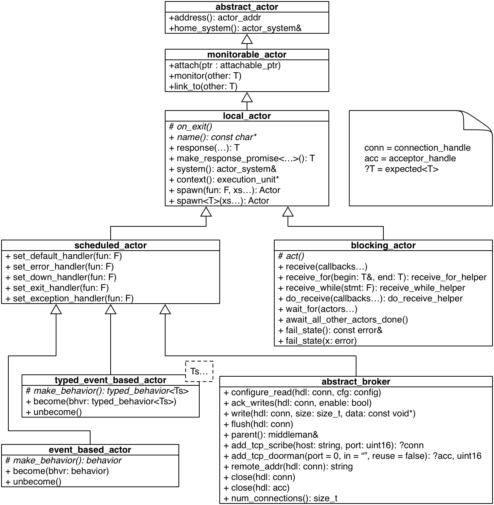

.. _actor:

Actors
======

Actors in CAF are a lightweight abstraction for units of computations. They
are active objects in the sense that they own their state and do not allow
others to access it. The only way to modify the state of an actor is sending
messages to it.

CAF provides several ways to implement actors, each covering a particular use
case. We distinguish between these characteristics: (1) dynamically or
statically typed, and (2) state-based or function-based. These characteristics
can be combined freely. For example, an actor can have dynamically typed
messaging and implement a state class.

Dynamically typed actors are more familiar to developers coming from Erlang or
Akka. They (usually) enable faster prototyping but require extensive unit
testing. Statically typed actors require more source code but enable the
compiler to verify communication between actors. Since CAF supports both,
developers can freely mix both kinds of actors to get the best of both worlds.
A good rule of thumb is to make use of static type checking for actors that are
visible across multiple translation units.

Actors in CAF are event-based, which means that they are scheduled
cooperatively. The implementation is lightweight with a memory footprint of only
few hundred bytes per actor. Developers can exclude---detach---event-based
actors that potentially starve others from the cooperative scheduling while
spawning it. A detached actor lives in its own thread of execution.

.. _actor-system:

Environment / Actor Systems
---------------------------

All actors live in an ``actor_system`` representing an actor environment
including :ref:`scheduler`, :ref:`registry`, and optional components such as a
:ref:`middleman`. A single process can have multiple ``actor_system`` instances,
but this is usually not recommended (a use case for multiple systems is to
strictly separate two or more sets of actors by running them in different
schedulers). For configuration and fine-tuning options of actor systems see
:ref:`system-config`. A distributed CAF application consists of two or more
connected actor systems. We also refer to interconnected ``actor_system``
instances as a *distributed actor system*.

Common Actor Types
------------------

The following pseudo-UML depicts the class diagram for actors in CAF.
Irrelevant member functions and classes as well as mixins are omitted for
brevity. Selected individual classes are presented in more detail in the
following sections.

.. _actor-types:

Class ``local_actor``
~~~~~~~~~~~~~~~~~~~~~

The class ``local_actor`` is the root type for locally executed actors in CAF.
It defines all common operations. However, users of the library usually do not
interact with this class directly and instead use one of the derived classes
``event_based_actor`` or ``typed_event_based_actor``. The following table also
includes member function inherited from ``abstract_actor`` (implementation
details that we only mention here for the sake of completeness).

+-------------------------------------+--------------------------------------------------------+
| **Types**                           |                                                        |
+-------------------------------------+--------------------------------------------------------+
| ``mailbox_type``                    | A concurrent, many-writers-single-reader queue type.   |
+-------------------------------------+--------------------------------------------------------+
|                                     |                                                        |
+-------------------------------------+--------------------------------------------------------+
| **Constructors**                    |                                                        |
+-------------------------------------+--------------------------------------------------------+
| ``(actor_config&)``                 | Constructs the actor using a config.                   |
+-------------------------------------+--------------------------------------------------------+
|                                     |                                                        |
+-------------------------------------+--------------------------------------------------------+
| **Observers**                       |                                                        |
+-------------------------------------+--------------------------------------------------------+
| ``actor_addr address()``            | Returns the address of this actor.                     |
+-------------------------------------+--------------------------------------------------------+
| ``actor_system& system()``          | Returns ``context()->system()``.                       |
+-------------------------------------+--------------------------------------------------------+
| ``actor_system& home_system()``     | Returns the system that spawned this actor.            |
+-------------------------------------+--------------------------------------------------------+
|                                     |                                                        |
+-------------------------------------+--------------------------------------------------------+
| **Actor Management**                |                                                        |
+-------------------------------------+--------------------------------------------------------+
| ``link_to(other)``                  | Links to ``other`` (see :ref:`link`).                  |
+-------------------------------------+--------------------------------------------------------+
| ``unlink_from(other)``              | Remove the link to ``other``.                          |
+-------------------------------------+--------------------------------------------------------+
| ``monitor(other)``                  | Adds a monitor to ``other`` (see :ref:`monitor`).      |
+-------------------------------------+--------------------------------------------------------+
| ``demonitor(other)``                | Removes a monitor from ``whom``.                       |
+-------------------------------------+--------------------------------------------------------+
| ``spawn(F fun, xs...)``             | Spawns a new actor from ``fun``.                       |
+-------------------------------------+--------------------------------------------------------+
| ``spawn<T>(xs...)``                 | Spawns a new actor of type ``T``.                      |
+-------------------------------------+--------------------------------------------------------+
|                                     |                                                        |
+-------------------------------------+--------------------------------------------------------+
| **Message Processing**              |                                                        |
+-------------------------------------+--------------------------------------------------------+
| ``T make_response_promise<Ts...>()``| Allows an actor to delay its response message.         |
+-------------------------------------+--------------------------------------------------------+
| ``T response(xs...)``               | Convenience function for creating fulfilled promises.  |
+-------------------------------------+--------------------------------------------------------+

Class ``scheduled_actor``
~~~~~~~~~~~~~~~~~~~~~~~~~

All scheduled actors inherit from ``scheduled_actor``. This includes
statically and dynamically typed event-based actors as well as brokers
:ref:`broker`.

+-------------------------------+--------------------------------------------------------------------------+
| **Types**                     |                                                                          |
+-------------------------------+--------------------------------------------------------------------------+
| ``exception_handler``         | ``function<error (pointer, std::exception_ptr&)>``                       |
+-------------------------------+--------------------------------------------------------------------------+
| ``default_handler``           | ``function<result<message> (pointer, message_view&)>``                   |
+-------------------------------+--------------------------------------------------------------------------+
| ``error_handler``             | ``function<void (pointer, error&)>``                                     |
+-------------------------------+--------------------------------------------------------------------------+
| ``down_handler``              | ``function<void (pointer, down_msg&)>``                                  |
+-------------------------------+--------------------------------------------------------------------------+
| ``exit_handler``              | ``function<void (pointer, exit_msg&)>``                                  |
+-------------------------------+--------------------------------------------------------------------------+
|                               |                                                                          |
+-------------------------------+--------------------------------------------------------------------------+
| **Constructors**              |                                                                          |
+-------------------------------+--------------------------------------------------------------------------+
| ``(actor_config&)``           | Constructs the actor using a config.                                     |
+-------------------------------+--------------------------------------------------------------------------+
|                               |                                                                          |
+-------------------------------+--------------------------------------------------------------------------+
| **Termination**               |                                                                          |
+-------------------------------+--------------------------------------------------------------------------+
| ``quit()``                    | Stops this actor with normal exit reason.                                |
+-------------------------------+--------------------------------------------------------------------------+
| ``quit(error x)``             | Stops this actor with error ``x``.                                       |
+-------------------------------+--------------------------------------------------------------------------+
|                               |                                                                          |
+-------------------------------+--------------------------------------------------------------------------+
| **Special-purpose Handlers**  |                                                                          |
+-------------------------------+--------------------------------------------------------------------------+
| ``set_exception_handler(F f)``| Installs ``f`` for converting exceptions to errors (see :ref:`error`).   |
+-------------------------------+--------------------------------------------------------------------------+
| ``set_down_handler(F f)``     | Installs ``f`` to handle down messages (see :ref:`down-message`).        |
+-------------------------------+--------------------------------------------------------------------------+
| ``set_exit_handler(F f)``     | Installs ``f`` to handle exit messages (see :ref:`exit-message`).        |
+-------------------------------+--------------------------------------------------------------------------+
| ``set_error_handler(F f)``    | Installs ``f`` to handle error messages (see :ref:`error-message`).      |
+-------------------------------+--------------------------------------------------------------------------+
| ``set_default_handler(F f)``  | Installs ``f`` as fallback message handler (see :ref:`default-handler`). |
+-------------------------------+--------------------------------------------------------------------------+

Class ``blocking_actor``
~~~~~~~~~~~~~~~~~~~~~~~~

A blocking actor provides a blocking API for message passing. Users generally
only interact with blocking actors through a ``scoped_actor``.

+----------------------------------+---------------------------------------------------+
| **Constructors**                 |                                                   |
+----------------------------------+---------------------------------------------------+
| ``(actor_config&)``              | Constructs the actor using a config.              |
+----------------------------------+---------------------------------------------------+
|                                  |                                                   |
+----------------------------------+---------------------------------------------------+
| **Termination**                  |                                                   |
+----------------------------------+---------------------------------------------------+
| ``const error& fail_state()``    | Returns the current exit reason.                  |
+----------------------------------+---------------------------------------------------+
| ``fail_state(error x)``          | Sets the current exit reason.                     |
+----------------------------------+---------------------------------------------------+
|                                  |                                                   |
+----------------------------------+---------------------------------------------------+
| **Actor Management**             |                                                   |
+----------------------------------+---------------------------------------------------+
| ``wait_for(Ts... xs)``           | Blocks until all actors ``xs...`` are done.       |
+----------------------------------+---------------------------------------------------+
| ``await_all_other_actors_done()``| Blocks until all other actors are done.           |
+----------------------------------+---------------------------------------------------+
|                                  |                                                   |
+----------------------------------+---------------------------------------------------+
| **Message Handling**             |                                                   |
+----------------------------------+---------------------------------------------------+
| ``receive(Ts... xs)``            | Receives a message using the callbacks ``xs...``. |
+----------------------------------+---------------------------------------------------+
| ``receive_for(T& begin, T end)`` | See receive-loop_.                                |
+----------------------------------+---------------------------------------------------+
| ``receive_while(F stmt)``        | See receive-loop_.                                |
+----------------------------------+---------------------------------------------------+
| ``do_receive(Ts... xs)``         | See receive-loop_.                                |
+----------------------------------+---------------------------------------------------+

.. _interface:

Messaging Interfaces
--------------------

Statically typed actors require abstract messaging interfaces to allow the
compiler to type-check actor communication. Interfaces in CAF are defined using
the variadic template ``typed_actor<...>``, which defines the proper
actor handle at the same time. Each template parameter defines one
``input/output`` pair via function signature syntax with the return type wrapped
in a ``result``. For example, ``typed_actor<result<string, string>(double)>``.
Also, the arguments must not use any cv-qualifiers.

In the same way functions cannot be overloaded only by their return type,
interfaces cannot accept one input twice (possibly mapping it to different
outputs). The example below defines a messaging interface for a simple
calculator.

.. literalinclude:: /examples/message_passing/calculator.cpp
   :language: C++
   :start-after: --(rst-calculator-actor-begin)--
   :end-before: --(rst-calculator-actor-end)--

It is not required to create a type alias such as ``calculator_actor``,
but it makes dealing with statically typed actors much easier. Also, a central
alias definition eases refactoring later on.

Interfaces have set semantics. This means the following two type aliases
``i1`` and ``i2`` are considered equal by CAF:

.. code-block:: C++

   using i1 = typed_actor<replies_to<A>::with<B>, replies_to<C>::with<D>>;
   using i2 = typed_actor<replies_to<C>::with<D>, replies_to<A>::with<B>>;

Further, actor handles of type ``A`` are assignable to handles of type
``B`` as long as ``B`` is a subset of ``A``.

For convenience, the class ``typed_actor<...>`` defines the member
types shown below to grant access to derived types.

+------------------------+---------------------------------------------------------------+
| **Types**              |                                                               |
+------------------------+---------------------------------------------------------------+
| ``behavior_type``      | A statically typed set of message handlers.                   |
+------------------------+---------------------------------------------------------------+
| ``base``               | Base type for actors, i.e., ``typed_event_based_actor<...>``. |
+------------------------+---------------------------------------------------------------+
| ``pointer``            | A pointer of type ``base*``.                                  |
+------------------------+---------------------------------------------------------------+
| ``stateful_impl<T>``   | See stateful-actor_.                                          |
+------------------------+---------------------------------------------------------------+
| ``stateful_pointer<T>``| A pointer of type ``stateful_impl<T>*``.                      |
+------------------------+---------------------------------------------------------------+
| ``extend<Ts...>``      | Extend this typed actor with ``Ts...``.                       |
+------------------------+---------------------------------------------------------------+
| ``extend_with<Other>`` | Extend this typed actor with all cases from ``Other``.        |
+------------------------+---------------------------------------------------------------+

.. _spawn:

Spawning Actors
---------------

Both statically and dynamically typed actors are spawned from an
``actor_system`` using the member function ``spawn``. The function takes a
function (or function object) as first argument, followed by any number of
arguments to pass to the function. The return value of ``spawn`` is a handle to
the newly spawned actor.

When spawning an actor from a state class ``State``, users can pass the function
object ``caf::actor_from_state<State>`` to ``spawn`` to have CAF automatically
pick the correct actor type for the state class and initialize the actor by
calling ``State::make_behavior()`` (this member function is required).

.. literalinclude:: /examples/message_passing/calculator.cpp
   :language: C++
   :start-after: --(rst-prototypes-begin)--
   :end-before: --(rst-prototypes-end)--

Spawning an actor for each implementation is illustrated below.

.. literalinclude:: /examples/message_passing/calculator.cpp
   :language: C++
   :start-after: --(rst-spawn-begin)--
   :end-before: --(rst-spawn-end)--

Additional arguments to ``spawn`` are passed to the constructor of a class or
used as additional function arguments, respectively. In the example above, none
of the functions takes any argument other than the implicit but optional
``self`` pointer.

.. _function-based:

Function-based Actors
---------------------

When using a function or function object to implement an actor, the first
argument *can* be used to capture a pointer to the actor itself. The type
of this pointer is usually ``event_based_actor*`` or
``blocking_actor*``. The proper pointer type for any
``typed_actor`` handle ``T`` can be obtained via
``T::pointer`` interface_.

Blocking actors simply implement their behavior in the function body. The actor
is done once it returns from that function.

Event-based actors can either return a ``behavior`` (see :ref:`message-handler`)
that is used to initialize the actor or explicitly set the initial behavior by
calling ``self->become(...)``. Due to the asynchronous, event-based nature of
this kind of actor, the function usually returns immediately after setting a
behavior (message handler) for the *next* incoming message. Hence, variables on
the stack will be out of scope once a message arrives. Managing state in
function-based actors can be done either via rebinding state with ``become``,
using heap-located data referenced via ``std::shared_ptr`` or by using the
*stateful actor* abstraction (see :ref:`stateful-actor`).

The following three functions implement the prototypes shown in spawn_ and
illustrate one blocking actor and two event-based actors (statically and
dynamically typed).

.. literalinclude:: /examples/message_passing/calculator.cpp
   :language: C++
   :start-after: --(rst-function-based-begin)--
   :end-before: --(rst-function-based-end)--

.. _class-based:

State-based Actors
------------------

Implementing an actor using a state class only requires implementing a member
function called ``make_behavior`` that returns either a ``behavior`` or a
``typed_behavior<...>``. Call will automatically deduce the type of the actor
from the return type, i.e., returning ``behavior`` creates a dynamically typed
actor, whereas returning ``typed_behavior<...>`` creates a statically typed
actor.

The constructor of the class can take any number of arguments. Optionally, the
first argument may be a pointer to the actor itself. The type of this pointer
must match the return type of ``make_behavior`` and is either
``event_based_actor*`` or ``typed_event_based_actor<...>*``.

When using typed actors, the usual pattern is to define an alias ``T`` for the
actor handle and then use ``T::behavior_type`` as return type for
``make_behavior`` and ``T::pointer`` for the ``self`` pointer.

The following example shows the implementation of the prototypes shown in spawn_
by delegating to the function-based implementations we have seen before:

.. literalinclude:: /examples/message_passing/calculator.cpp
   :language: C++
   :start-after: --(rst-state-based-begin)--
   :end-before: --(rst-state-based-end)--

.. _stateful-actor:

Attaching Cleanup Code to Actors
--------------------------------

Users can attach cleanup code to actors. This code is executed immediately if
the actor has already exited. Otherwise, the actor will execute it as part of
its termination. The following example attaches a function object to actors for
printing a custom string on exit.

.. code-block:: C++

  // Utility function to print an exit message with custom name.
  void print_on_exit(const actor& hdl, const std::string& name) {
    hdl->attach_functor([=](const error& reason) {
      cout << name << " exited: " << to_string(reason) << endl;
    });
  }

It is possible to attach code to remote actors. However, the cleanup code will
run on the local machine.

.. _blocking-actor:

Blocking Actors
---------------

Blocking actors always run in a separate thread and are not scheduled by CAF.
Unlike event-based actors, blocking actors have explicit, blocking *receive*
functions. Further, blocking actors do not handle system messages automatically
via special-purpose callbacks (see :ref:`special-handler`). This gives users
full control over the behavior of blocking actors. However, blocking actors
still should follow conventions of the actor system. For example, actors should
unconditionally terminate after receiving an ``exit_msg`` with reason
``exit_reason::kill``.

Receiving Messages
~~~~~~~~~~~~~~~~~~

The function ``receive`` sequentially iterates over all elements in the
mailbox beginning with the first. It takes a message handler that is applied to
the elements in the mailbox until an element was matched by the handler. An
actor calling ``receive`` is blocked until it successfully dequeued a
message from its mailbox or an optional timeout occurs. Messages that are not
matched by the behavior are automatically skipped and remain in the mailbox.

.. code-block:: C++

   self->receive (
      { /* ... */ }
   );

.. _catch-all:

Catch-all Receive Statements
~~~~~~~~~~~~~~~~~~~~~~~~~~~~

Blocking actors can use inline catch-all callbacks instead of setting a default
handler (see :ref:`default-handler`). A catch-all case must be the last callback
before the optional timeout, as shown in the example below.

.. code-block:: C++

   self->receive(
     [&](float x) {
       // ...
     },
     [&](const down_msg& x) {
       // ...
     },
     [&](const exit_msg& x) {
       // ...
     },
     others >>  -> skippable_result {
       // report unexpected message back to client
       return sec::unexpected_message;
     }
   );

.. _receive-loop:

Receive Loops
~~~~~~~~~~~~~

Message handler passed to ``receive`` are temporary object at runtime.
Hence, calling ``receive`` inside a loop creates an unnecessary amount
of short-lived objects. CAF provides predefined receive loops to allow for
more efficient code.

.. code-block:: C++

   // BAD
   std::vector<int> results;
   for (size_t i = 0; i < 10; ++i)
     receive (
       [&](int value) {
         results.push_back(value);
       }
     );

   // GOOD
   std::vector<int> results;
   size_t i = 0;
   receive_for(i, 10) (
     [&](int value) {
       results.push_back(value);
     }
   );

.. code-block:: C++

   // BAD
   size_t received = 0;
   while (received < 10) {
     receive (
       [&](int) {
         ++received;
       }
     );
   } ;

   // GOOD
   size_t received = 0;
   receive_while([&] { return received < 10; }) (
     [&](int) {
       ++received;
     }
   );

.. code-block:: C++

   // BAD
   size_t received = 0;
   do {
     receive (
       [&](int) {
         ++received;
       }
     );
   } while (received < 10);

   // GOOD
   size_t received = 0;
   do_receive (
     [&](int) {
       ++received;
     }
   ).until([&] { return received >= 10; });

The examples above illustrate the correct usage of the three loops
``receive_for``, ``receive_while`` and
``do_receive(...).until``. It is possible to nest receives and receive
loops.

.. code-block:: C++

   bool running = true;
   self->receive_while([&] { return running; }) (
     [&](int value1) {
       self->receive (
         [&](float value2) {
           self->println("{} => {}", value1, value2);
         }
       );
     },
     // ...
   );

.. _scoped-actors:

Scoped Actors
~~~~~~~~~~~~~

The class ``scoped_actor`` offers a simple way of communicating with
CAF actors from non-actor contexts. It overloads ``operator->`` to
return a ``blocking_actor*``. Hence, it behaves like the implicit
``self`` pointer in functor-based actors, only that it ceases to exist
at scope end.

.. code-block:: C++

   void test(actor_system& system) {
     scoped_actor self{system};
     // spawn some actor
     auto aut = self->spawn(my_actor_impl);
     self->send(aut, "hi there");
     // self will be destroyed automatically here; any
     // actor monitoring it will receive down messages etc.
   }
