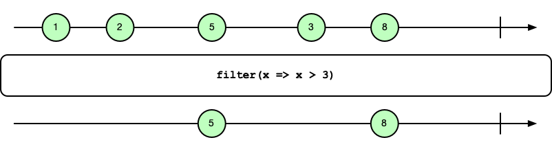
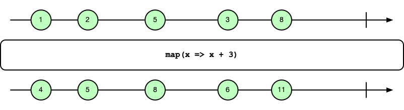
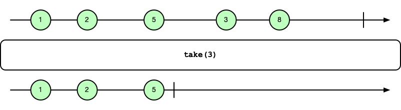
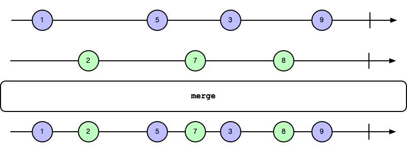
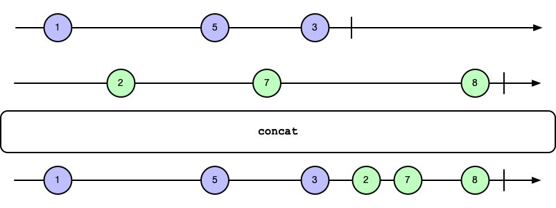

.. _data_flows:

Data Flows
==========

Data flows, or *streams*, are potentially unbound sequences of values. The flow
API in CAF makes it easy to generate, transform, and consume observable
sequences with a `ReactiveX <https://reactivex.io/>`_-style interface.

Flows that pass through two or more actors use backpressure to make sure that
fast senders cannot overwhelm receivers.

We do not assume prior experience with ReactiveX for this chapter and there are
some key differences to ReactiveX implementations that we pointer out in
`Key Differences to ReactiveX`_.

Introduction
------------

The fundamental building blocks of the flow API are ``observable``, ``observer``
and ``subscription``.

``observable``
  Emits a potentially unbound sequence of values to observers that have
  subscribed to the observable. Offers the single member function ``subscribe``
  to add more observers.

``observer``
  Subscribes to and consumes values from an observable. This interface bundles
  callbacks for the  observable, namely ``on_subscribe``, ``on_next``,
  ``on_complete`` and ``on_error``.

``subscription``
  Manages the flow of items between an observable and an observer. An observer
  calls ``request`` to ask for more items or ``cancel`` to stop receiving data.

When working with data flows, the primitive building blocks usually remain in
the background. For example, the code snippet below illustrates a trivial data
flow for integers inside a single actor that only uses the high-level
composition API without any manual setup for observers or subscriptions:

.. literalinclude:: /examples/flow/from-callable.cpp
   :language: C++
   :start-after: --(rst-main-begin)--
   :end-before: --(rst-main-end)--

Concurrent Processing
---------------------

Flows that only run inside a single actors are of course quite useless outside
of toy examples. For running different parts of a data flow on different actors,
CAF offers two APIs: one for setting up a processing chain declaratively and one
for setting up processing chains dynamically.

Declarative Setup: ``observe_on``
+++++++++++++++++++++++++++++++++

If the entire processing chain is known at coding time, ``observe_on`` provides
the easiest way to assign work to individual actors. The following example
revisits our first example, but this time generates the numbers on one actor and
then prints them on another.

.. literalinclude:: /examples/flow/observe-on.cpp
   :language: C++
   :start-after: --(rst-main-begin)--
   :end-before: --(rst-main-end)--

Please note that calling ``observe_on`` *requires* that the target actor is
inactive. Otherwise, this function call results in unsynchronized state access.

Dynamic Setup: Asynchronous Buffers
+++++++++++++++++++++++++++++++++++

Our second option for spanning data flows across multiple actors is using SPSC
(Single Producer Single Consumer) buffers. This option is more general. In fact,
``observe_on`` internally uses these buffers for connecting the actors. Further,
the buffers allows bridging flows between actor and non-actor code.

While one could use an SPSC buffer directly, they usually remain hidden behind
another abstraction: asynchronous resources. The resources in CAF usually come
in pairs and users may create new ones by calling ``make_spsc_buffer_resource``.
This function returns a producer resource and a consumer resource. With these
two resources, we can then spawn actors that open the resources for either
reading or writing.

To illustrate how the API pieces fit together, we revisit our example a third
time. This time, we spawn the actors individually and connect them via the
buffer resources:

.. literalinclude:: /examples/flow/spsc-buffer-resource.cpp
   :language: C++
   :start-after: --(rst-main-begin)--
   :end-before: --(rst-main-end)--

In this iteration of our example, we have moved the implementation for the
source and sink actors to their own functions. The source once again creates the
data, only this time we subscribe the buffer to the generated sequence:

.. literalinclude:: /examples/flow/spsc-buffer-resource.cpp
   :language: C++
   :start-after: --(rst-source-begin)--
   :end-before: --(rst-source-end)--

For the sink, we generate an observable from the consumer resource and then once
more call ``for_each``:

.. literalinclude:: /examples/flow/spsc-buffer-resource.cpp
   :language: C++
   :start-after: --(rst-sink-begin)--
   :end-before: --(rst-sink-end)--

Building and Transforming Observables
-------------------------------------

When building processing pipelines, CAF fuses as many processing steps as
possible into a single C++ object. In our examples, we composed the source part
like this:
``self->make_observable().from_callable(...).take(...)...``.

The first bit, ``self->make_observable()``, returns an ``observable_builder``.
This class implements factory functions for creating observable sequences from
containers, repeated values, and so on. However, most functions do not actually
return an ``observable``. Instead, they return a ``generation<...>`` object.

The ``generation`` class is a variadic template that allows CAF to incrementally
define consecutive processing steps. In our example, we call ``from_callable``
on the builder object, which returns a ``generation<callable_source<...>>``. The
generation is meant as temporary object only. Hence, most member functions
may only get called on an rvalue.

After calling ``.take(...)`` on the returned ``generation``, we get a new
temporary object of type ``generation<callable_source<...>, limit_step<...>>``.

The ``generation`` class also mimics the interface of ``observable``. When
calling a member function that requires an actual ``observable``, CAF uses the
blueprint stored in the ``generation`` to create an actual observable object and
then forward the member function call. For example, calling ``for_each`` on a
``generation`` internally constructs the ``observable`` and then calls
``for_each`` on that new object.

Users can also call ``as_observable`` on a ``generation`` explicitly to turn the
blueprint into an actual observable sequence.

By delaying the construction of actual ``observable`` instances, CAF can fuse
consecutive steps into single objects. This reduces the number of heap
allocations and also accelerates processing, since the fused processing steps
result in simple function call chains without subscriptions and backpressure
between them.

Analogues to the ``generation`` class for creating new observables from inputs,
CAF uses a template called ``transformation`` that represents a blueprint for
applying operators to existing observables.

Operators
---------

Most operators transform an observable by applying one or more processing steps
on all observed values and then emit the result as a new observable. Since the
result of a transformation usually is new observable, these operators compose
into complex data stream operations.

The operators presented here are available on the template classes
``observable``, ``generation`` and ``transformation``.

Filter
++++++

The ``filter`` operator re-emits items from its input observable that pass a
predicate test.

Map
+++

The ``map`` operator applies a unary operation to all items of the input
observable and re-emits the resulting items. Similar to
`std::transform <https://en.cppreference.com/w/cpp/algorithm/transform>`_.

Take
++++

The ``take`` operator re-emits the first ``n`` items from its input observable.

Merge
+++++

The ``merge`` operator takes multiple input observables and re-emits the
observed items as a single sequence of items as soon as they appear.

Concat
++++++

The ``concat`` operator takes multiple input observables and re-emits the
observed items as a single sequence of items without interleaving them.

Key Differences to ReactiveX
----------------------------

Observables are not thread-safe. They describe a flow of data *within* an actor
and are thus considered private to an actor.

CAF is more "opinionated" than ReactiveX when it comes to concurrency and
ownership. The intended way for connecting concurrent parts of the system is by
creating buffer resources and turning them into observables at the observing
actor.

Furthermore, CAF does not support the scheduler interface from ReactiveX. Data
flows are usually managed by an actor. Hence, there is no analog for operators
such as ``SubscribeOn``. That being said, the flow API does not tie observables
or observers to actor types. The interface ``caf::flow::coordinator`` manages
scheduling of flow-related work and can be implemented to run CAF flows without
actors, e.g., to integrate them into a custom event loop.

Observers and observables use non-blocking backpressure by default. The protocol
used between observers and observables to signal demand is similar to the
`Reactive Streams <https://www.reactive-streams.org>`_ specification.
