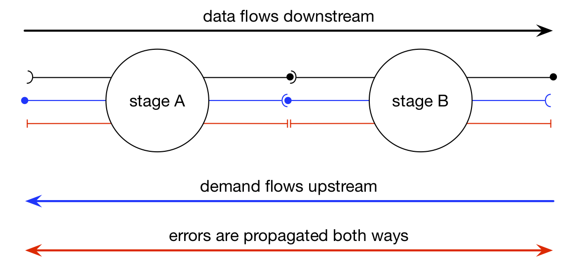

.. _streaming:

Streaming :sup:`experimental`
=============================

Streams in CAF describe data flow between actors. We are not aiming to provide
functionality similar to Apache projects like Spark, Flink or Storm. Likewise,
we have different goals than APIs such as RxJava, Reactive Streams, etc.
Streams complement asynchronous messages, request/response communication and
publish/subscribe in CAF. In a sense, actor streams in CAF are a building
block that users could leverage for building feature-complete stream
computation engines or reactive high-level Big Data APIs.

A stream establishes a logical channel between two or more actors for
exchanging a potentially unbound sequence of values. This channel uses demand
signaling to guarantee that senders cannot overload receivers.

.. _stream:

Streams are directed and data flows only *downstream*, i.e., from sender
(source) to receiver (sink). Establishing a stream requires a handshake in
order to initialize required state and signal initial demand.

.. _stream-roles:

.. image:: stream-roles.png
   :alt: Streaming Roles

CAF distinguishes between three roles in a stream: (1) a *source* creates
streams and generates data, (2) a *stage* transforms or filters data, and
(3) a *sink* terminates streams by consuming data.

We usually draw streams as pipelines for simplicity. However, sources can have
any number of outputs (downstream actors). Likewise, sinks can have any number
of inputs (upstream actors) and stages can multiplex N inputs to M outputs.
Hence, streaming topologies in CAF support arbitrary complexity with forks and
joins.

Stream Managers
---------------

Streaming-related messages are handled separately. Under the hood, actors
delegate to *stream managers* that in turn allow customization of their
behavior with *drivers* and *downstream managers*.

.. _fig-stream-manager:

.. image:: stream-manager.png
   :alt: Internals of Stream Managers

Users usually can skip implementing driver classes and instead use the
lambda-based interface showcased in the following sections. Drivers implement
the streaming logic by taking inputs from upstream actors and pushing data to
the downstream manager. A source has no input buffer. Hence, drivers only
provide a *generator* function that downstream managers call according to
demand.

A downstream manager is responsible for dispatching data to downstream actors.
The default implementation broadcasts data, i.e., all downstream actors receive
the same data. The downstream manager can also perform any sort multi- or
anycast. For example, a load-balancer would use an anycast policy to dispatch
data to the next available worker.

Defining Sources
----------------

.. literalinclude:: /examples/streaming/integer_stream.cpp
   :language: C++
   :start-after: --(rst-source-begin)--
   :end-before: --(rst-source-end)--

The simplest way to defining a source is to use the ``attach_stream_source``
function and pass it four arguments: a pointer to *self*, *initializer* for the
state, *generator* for producing values, and *predicate* for signaling the end
of the stream.

Defining Stages
---------------

.. literalinclude:: /examples/streaming/integer_stream.cpp
   :language: C++
   :start-after: --(rst-stage-begin)--
   :end-before: --(rst-stage-end)--

The function ``make_stage`` also takes three lambdas but additionally the
received input stream handshake as first argument. Instead of a predicate,
``make_stage`` only takes a finalizer, since the stage does not produce data on
its own and a stream terminates if no more sources exist.

Defining Sinks
--------------

.. literalinclude:: /examples/streaming/integer_stream.cpp
   :language: C++
   :start-after: --(rst-sink-begin)--
   :end-before: --(rst-sink-end)--

The function ``make_sink`` is similar to ``make_stage``, except that is does not
produce outputs.

Initiating Streams
------------------

.. literalinclude:: /examples/streaming/integer_stream.cpp
   :language: C++
   :start-after: --(rst-main-begin)--
   :end-before: --(rst-main-end)--

In our example, we always have a source ``int_source`` and a sink ``int_sink``
with an optional stage ``int_selector``. Sending ``open_atom`` to the source
initiates the stream and the source will respond with a stream handshake.

Using the actor composition in CAF (``snk * src`` reads *sink after source*)
allows us to redirect the stream handshake we send in ``caf_main`` to the sink
(or to the stage and then from the stage to the sink).
